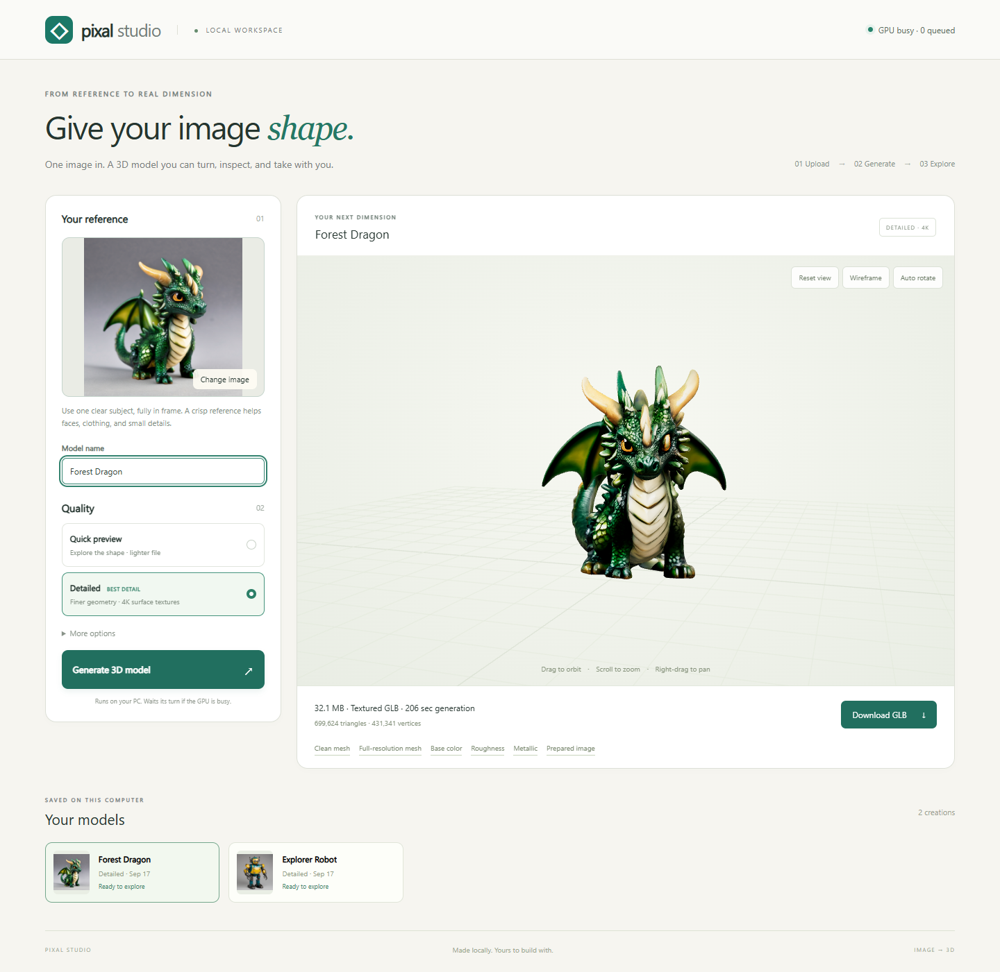

# Install Pixal Studio on Windows

Pixal Studio is a free local interface for an existing ComfyUI image-to-3D
backend. This v0.1.0 developer preview is intended for people comfortable
running ComfyUI. It is not a standalone installer and does not include AI weights.

[Try the interactive examples first](https://joelcomputers.github.io/pixal-studio/).

## 1. Check your backend

You need Python 3.12 for this interface, a modern browser, and a working local
ComfyUI installation with native Pixal3D/TRELLIS.2, background removal, and
mesh/texture nodes. The interface has no PyTorch dependency; GPU dependencies
belong to ComfyUI's separate Python environment.

Follow the [official ComfyUI Pixal3D setup guide](https://docs.comfy.org/tutorials/3d/pixal3d)
for the backend. The tested backend revision is recorded in
[the project README](../README.md#requirements). Do not assume an older installation
has every required node. A completely fresh GPU installation and Linux generation
have not yet been validated for this release; no minimum VRAM requirement is claimed.

Start ComfyUI normally. Confirm that its interface opens at
<http://127.0.0.1:8188>. If yours uses another address or port, use it in step 4.

## 2. Check the five model files

Use the exact download URLs, sizes, and SHA256 values in
[models.json](../manifests/models.json). Read
[the external model notices](../THIRD_PARTY_NOTICES.md) before downloading.
Place each file under your ComfyUI model directory as follows:

| Folder inside `ComfyUI/models` | File |
| --- | --- |
| `diffusion_models` | `pixal3d_int8_convrot.safetensors` |
| `clip_vision` | `dino_v3_L_naf_fp32.safetensors` |
| `vae` | `trellis_2_shape_vae_bf16.safetensors` |
| `vae` | `trellis_2_texture_vae_bf16.safetensors` |
| `background_removal` | `birefnet.safetensors` |

Restart ComfyUI if needed so the new files appear in its model selectors.

## 3. Download and install the interface

Open [the v0.1.0 release](https://github.com/JoelComputers/pixal-studio/releases/tag/v0.1.0).
Download **pixal-studio-0.1.0-source.zip** from Assets. Choose that named file;
it includes the browser viewer dependencies. Extract it, then open PowerShell
inside the extracted `pixal-studio` folder (the folder containing `server.py`).

Check Python:

```powershell
py -3.12 --version
```

If this fails, install Python 3.12 from [python.org](https://www.python.org/downloads/windows/)
with its Windows Python launcher, then reopen PowerShell.

Create the interface's own environment and install its small dependency set:

```powershell
py -3.12 -m venv .venv
.\.venv\Scripts\python.exe -m pip install -r requirements.txt
Copy-Item config.example.json config.local.json
notepad config.local.json
```

No environment activation or PowerShell execution-policy change is required.
On a repeat installation, preserve your existing `config.local.json` rather than
copying the example over it.

## 4. Point it at your ComfyUI folders

For example, if ComfyUI is installed in `D:\AI\ComfyUI`, save this configuration:

```json
{
  "comfy_url": "http://127.0.0.1:8188",
  "output_dir": "D:/AI/ComfyUI/output",
  "models_dir": "D:/AI/ComfyUI/models",
  "data_dir": "data",
  "models": {}
}
```

Replace both `D:/AI/ComfyUI` paths with your actual paths. `output_dir` must be
the directory your running ComfyUI writes to, including any custom output location.
Forward slashes are valid in Windows JSON paths. Leave `models` empty for the
standard filenames above. Custom filenames/subfolders can be mapped by model role;
see [configuration](../README.md#configuration-and-diagnostics).

## 5. Run the readiness check

With ComfyUI running:

```powershell
.\.venv\Scripts\python.exe doctor.py --hash-models
```

Look for `"ok": true` and `"errors": []`. This reads the model files and checks
the backend's node definitions; it does not generate a model or reserve a GPU.
Hashing several gigabytes can take a while. Resolve any errors before generating.

## 6. Make your first model

```powershell
.\.venv\Scripts\python.exe server.py
```

Open <http://127.0.0.1:8790>. Keep the terminal open.

1. Choose one clear PNG, JPEG, or WebP with the whole object visible.
2. Choose **Quick preview** to explore the shape, or **Detailed** for UV textures.
3. Click **Generate 3D model**. It joins ComfyUI's normal queue.
4. When complete, drag to orbit, scroll to zoom, and click **Download GLB**.



To reproduce the gallery's dragon, use [this input image](images/forest-dragon-input.png),
**Detailed**, and seed **42** under More options. This example used 1536 resolution,
a target of 700,000 triangles, and 4096-pixel textures. Our measured generation
took 206.2 seconds, excluding queue time; this is not a speed promise for other PCs.
Results can differ with backend and hardware changes. The reference was generated
locally with SDXL; the 3D result comes from Pixal Studio's pipeline.

On later launches, start ComfyUI, then double-click **Start Studio.cmd**.

## Troubleshooting

| What you see | What to check |
| --- | --- |
| Cannot reach ComfyUI | Start it and verify `comfy_url`, including the port. |
| Missing node / schema error | Check ComfyUI's version and startup errors against the official setup guide. Do not randomly install similarly named nodes. |
| Missing model | Check the exact folder, filename, and `models_dir`. |
| Model size or SHA256 mismatch | Download the affected file again from the pinned manifest URL. A plausible filename and size alone do not prove integrity. |
| Generated files unavailable | Set `output_dir` to the running backend's actual output directory. |
| Missing viewer asset | Use the named release ZIP; for a Git checkout, run `npm ci` in the project folder. |
| Out of GPU memory | Wait for other GPU work to finish and try Quick preview. Do not start another backend or cancel someone else's job. |
| Soft details or distorted shape | Try a sharper single-subject reference and compare presets. Fine details and unseen surfaces can need manual work. |

Need help? [Open an issue](https://github.com/JoelComputers/pixal-studio/issues/new/choose)
with your OS, GPU/VRAM, ComfyUI version, preset, and relevant error text.
Remove private paths and personal information before sharing logs.

The service is local-only. Public hosting, authentication, and online generation
are separate work; this walkthrough does not expose your PC to the internet.
