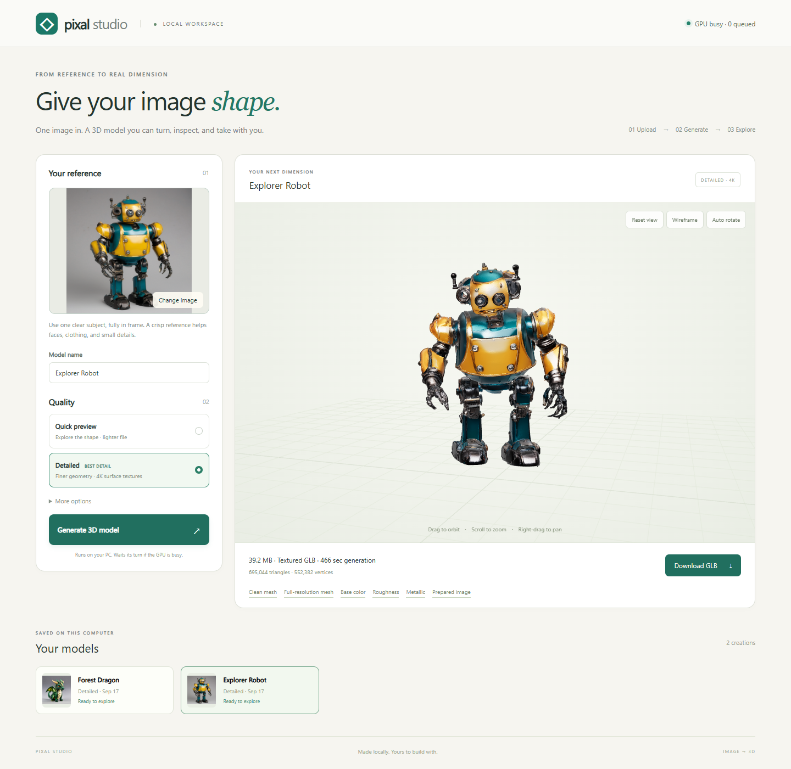
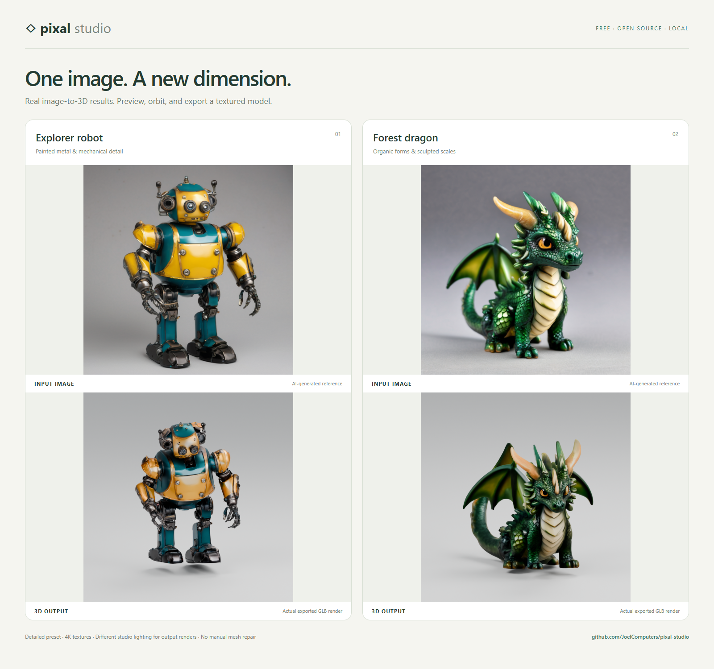

# Example gallery: real inputs and exported results

These examples were made specifically for Pixal Studio's public page. The
subjects are an explorer robot and a forest dragon figurine.
There are no people or sexual themes in the published examples.

## How the images were made

1. Generate an original reference locally with SDXL 1.0 base: 1024 x 1024,
   30 steps, DPM++ 2M, Karras schedule, CFG 6. The references are AI-generated
   product-style images, not photographs of real manufactured objects.
2. Upload that image through the actual Pixal Studio GUI service and run the
   unmodified Detailed preset: seed 42, 1536 resolution, approximately 700k
   output triangles, and 4096-pixel texture maps.
3. Import the exported textured GLB into Blender and render it with studio
   lighting on the CPU. The generated geometry and textures are unchanged.
   Render settings: Cycles, 32 samples, denoising, 900 x 900, orthographic camera.
4. Capture the actual app showing one of those completed jobs. The screenshot
   uses an isolated demonstration history containing only these examples.

Different viewpoints and lighting make the material appearance differ from
the reference. Thin parts, small details, proportions, and unseen surfaces can
change during reconstruction. No manual sculpting, mesh repair, or texture
retouching was applied to make these results look more accurate.

The individual input PNGs are in [images](images/). See [provenance.json](provenance.json)
for the input prompts, seeds, file hashes, generation duration, and GLB hashes.
Generation timings exclude queue time and CPU rendering. They are measurements
of these specific runs on the shared local backend, not performance promises.

## View the application

## Before and after

The source software uses ComfyUI's Pixal3D/Trellis2 pipeline. These are generated
examples, not evidence of production-ready topology or guaranteed fidelity.
The program's license and external model terms are documented in
[THIRD_PARTY_NOTICES.md](../THIRD_PARTY_NOTICES.md).
